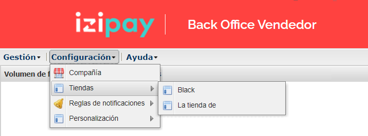
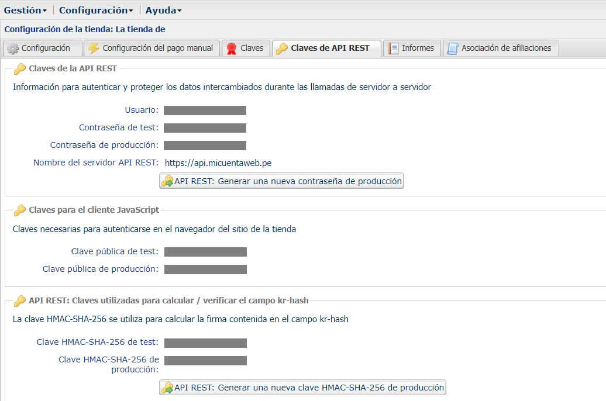
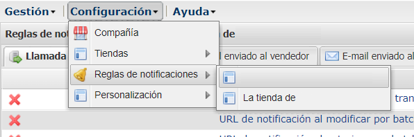
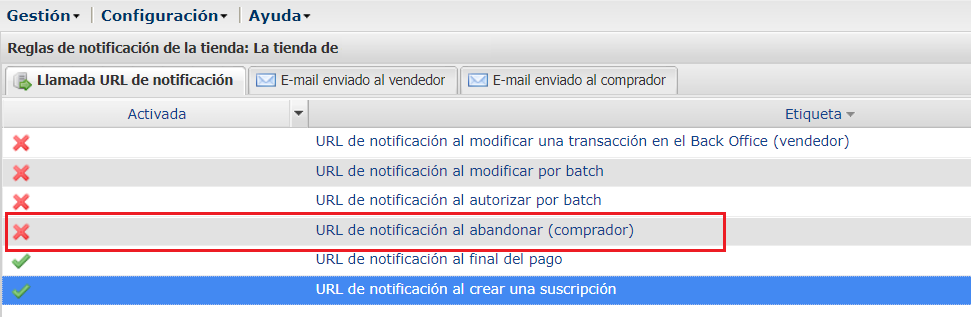
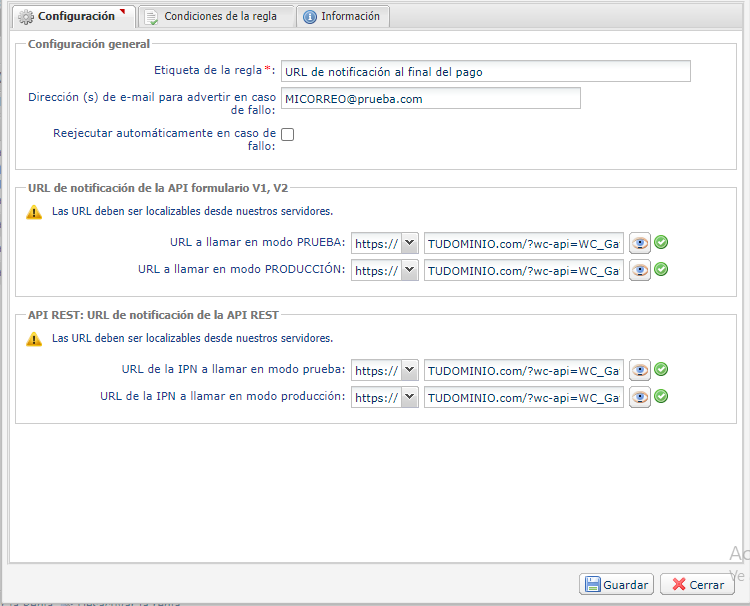

# Embedded-Form-Izipay in PHP

Este es un ejemplo de trabajo de la pasarela de pago  Izipay con un formulario de pago integrado. 
Para obtener más información, consulte la documentación aquí [Documentación Izipay](https://secure.micuentaweb.pe/doc/es-PE/form-payment/standard-payment/sitemap.html).

## Requisitos previos
* PHP ^7.0

## 1.- Descargar el proyecto 
Descargar el proyecto en formato .zip ingresando [aquí](https://github.com/izipay-pe/Embedded-PaymentFormD1-PHP/archive/refs/heads/main.zip) o clonarlo con el siguiente comando:

```sh
git clone https://github.com/izipay-pe/Embedded-PaymentFormD1-PHP.git
``` 
## 2.- Obtener las credenciales

1. Ingresar al [Back Office Vendedor](https://secure.micuentaweb.pe/vads-merchant/loginAction.init.a ) 
para obtener las crecenciales.
2. Ingresar a CONFIGURACIÓN > TIENDAS > [SU TIENDA].

3.  Después de seleccionar  la tienda, verá la siguiente sección con todas las credenciales requeridas para su implementación.


Consulte el siguiente [enlace](https://secure.micuentaweb.pe/doc/es-PE/rest/V4.0/api/get_my_keys.html) para obtener más información sobre este paso.

## 3.- Configurar las credenciales:
Copiar las crendenciales del [Back Office Vendedor](https://secure.micuentaweb.pe/vads-merchant/loginAction.init.a ) en las variables correspondientes, estas se encuentran en el archivo: `keys.php`  

```sh
/* Username, password and endpoint used for server to server web-service calls */

//(En el Back Office) Copiar Usuario
KEY_USER = 'XXXXXXXX'

//(En el Back Office) Copiar Contraseña de test
KEY_PASSWORD = 'testpassword_XXXXXXXXXXXXXXXXXXXXXXXXXXXXXXXXXXXXXXXXXXXXXX'

//(En el Back Office) Copiar Contraseña de Nombre del servidor API REST
Lyra\Client::setDefaultEndpoint("https://api.micuentaweb.pe");

/* publicKey and used by the javascript client */
//(En el Back Office) Copiar Clave pública de test
KEY_JS = 'XXXXXXXX:testpublickey_XXXXXXXXXXXXXXXXXXXXXXXXXXXXXXXXXXXXXX'

/* SHA256 key */
//(En el Back Office) Clave HMAC-SHA-256 de test
KEY_SHA256 = 'XXXXXXXXXXXXXXXXXXXXXXXXXXXXXXXXXXXXX'
``` 
## 4.-Configurar la respuesta del pago por IPN

Establezca una URL de notificación al final del pago para que su servidor web 
conozca la información del estado de pago de la transacción. Consulte la 
documentación de la [IPN](https://secure.micuentaweb.pe/doc/es-PE/form-payment/quick-start-guide/implementar-la-ipn.html) 
para obtener más información.

Por defecto, los comerciantes no son notificados en caso de cancelación. 
Las reglas de notificación relevantes deben estar habilitadas
en el [Back Office Vendedor](https://secure.micuentaweb.pe/vads-merchant/loginAction.init.a ).

### Para configurar la notificación:

1. Ir al menú: CONFIGURACIÓN > REGLAS DE NOTIFICACIONES > [SU TIENDA], .


2. Hacer clic derecho en el item `URL de notificación al abandonar (comprador)` y seleccionar la opción `Gestionar la regla`.


3. En la sección `Configuración general`, modificar el campo `Dirección (s) de e-mail para advertir en caso de fallo` y marcar la casilla `Reejecutar automáticamente en caso de fallo` si desea autorizar a la plataforma a reenviar automáticamente la notificación hasta 4 veces en caso de fallo.


f)En la sección URL de notificación de la API REST , indique la URL de su página en los campos URL de destino de la IPN a la que se llamará en modo TEST y URL de destino de la IPN a la que se llamará en modo PRODUCTION .
Guarde los cambios.

g)Active la regla haciendo clic derecho en URL de notificación de cancelación y seleccionando Activar la regla .




## 5.- Ejecutar el proyecto
Abrir la aplicación instalada de Xampp y ejecutar el botón **Start** del modulo de **Apache**
Luego abrir la siguiente url en su navegador web (Chrome, Mozilla, Safari, etc) con el puerto 80: **http://localhost:80/**.


